  <!-- Animated Constellation Header -->
  

  

  

    
    
    
  

---

### 📌 Overview & Focus

Focused on **Data Analytics, Applied Statistics, Machine Learning, and Mathematical Optimization**. Experienced in multivariate statistical modeling, computer vision pipelines, operational research (MILP), academic curriculum design, as well as data processing and visualization.

- 🔬 **Data Analytics Staff** at *Statistics Center & Survey Independent* (SC-SCSI).
- 🎓 **Teaching Assistant** for *Non-Parametric Statistics* and *Algorithms & Programming*.
- 🏆 **Bakti BCA Scholarship Awardee 2025** (Selected among 700+ applicants).
- 🚀 **Project Leader** at *Bakti Champions Movement*.
- 🏅 **Best Intern & Best Junior Staff** at BEM Universitas Diponegoro.

---

### 📂 Featured Projects & Repositories

| Repository / Project | Tech Stack | Highlights |
| :--- | :--- | :--- |
| [**PANENVISION: Food Security Command Center**](https://sec-panenvision-buzu.vercel.app/) | `Python` `React` `TypeScript` `SciPy / MILP` `TailwindCSS` | Predictive & prescriptive food security platform for Central Java (Satria Data SEC). Integrates *time-series forecasting*, *spatial balance modeling*, and commodity distribution optimization using *Robust Mixed-Integer Linear Programming (MILP Agri-GotongRoyong)*. [<ins>Live Demo</ins>](https://sec-panenvision-buzu.vercel.app/) |
| [**RICEFLOW: Rice Supply Chain Decision Support System**](https://riceflowdek-uetc.vercel.app/) | `Python` `Network DEA` `Simar-Wilson` `SHAP` `React` | Multi-stage rice supply chain efficiency & decision-support platform for West Java (FIT Competition 2026). Combines *Network DEA*, *Robust & Bootstrap DEA (Simar-Wilson)*, *Explainable ML (SHAP)*, and *Fair Share Ratio (FSR)* to optimize resource distribution and safeguard agricultural labor wages. [<ins>Live Demo</ins>](https://riceflowdek-uetc.vercel.app/) |
| [**BDC-2026-Waste-Classification**](https://github.com/satriaazmi/BDC-2026-Waste-Classification) | `PyTorch` `SigLIP2` `ConvNeXt` `TTA` `Cleanlab` | Deep Learning & Computer Vision pipeline for multi-class solid waste classification on 26,500+ images (Satria Data BDC). Implements *Out-of-Fold (OOF) Label Noise Audit*, *Probability Calibration*, *Test-Time Augmentation (TTA)*, and ensemble vision architectures (Macro-F1 99.51%). |
| [**Bengawan-Solo-TMA-Forecasting**](https://github.com/satriaazmi/Bengawan-Solo-TMA-Forecasting) | `Python` `LightGBM` `CatBoost` `Hydro-Informatics` `Scikit-Learn` | Spatio-temporal Physical ML & Hydro-Informatics pipeline for 30-station water level (TMA) forecasting in Bengawan Solo River Basin across a 242-day horizon (Sebelas Maret Statistics & Data Science 2026). Implements Manning rating curve log-stage transforms, multi-depth soil moisture gradient modeling, and spatial kriging. |
| [**NonParametric-Statistics-Module**](https://github.com/satriaazmi/NonParametric-Statistics-Module) | `R` `RStudio` `Markdown` `LaTeX` | Comprehensive laboratory practicum module & computational inference toolkit in R for non-parametric hypothesis testing (Wilcoxon, Mann-Whitney, Kruskal-Wallis, Chi-Square, Friedman) and methodology selection for non-normal distributions. |
| [**Algorithm-Programming-Lab**](https://github.com/satriaazmi/Algorithm-Programming-Lab) | `R` `RStudio` `LaTeX` | Academic teaching repository covering fundamental algorithms, statistical data structures (vectors, matrices, data frames), probability simulations, and regression modeling in R. |

---

### 🛠️ Tech Stack & Tools

  

---

### 📊 GitHub Analytics & Streak

  
  

   

  

---

### 🐍 Contribution Activity

  

---

  

